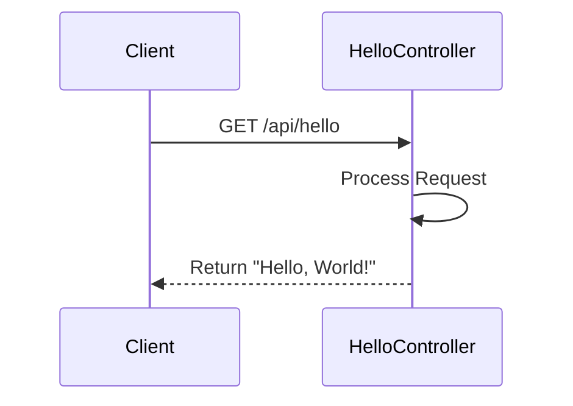
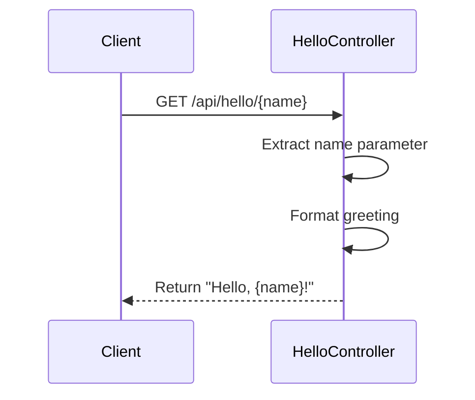
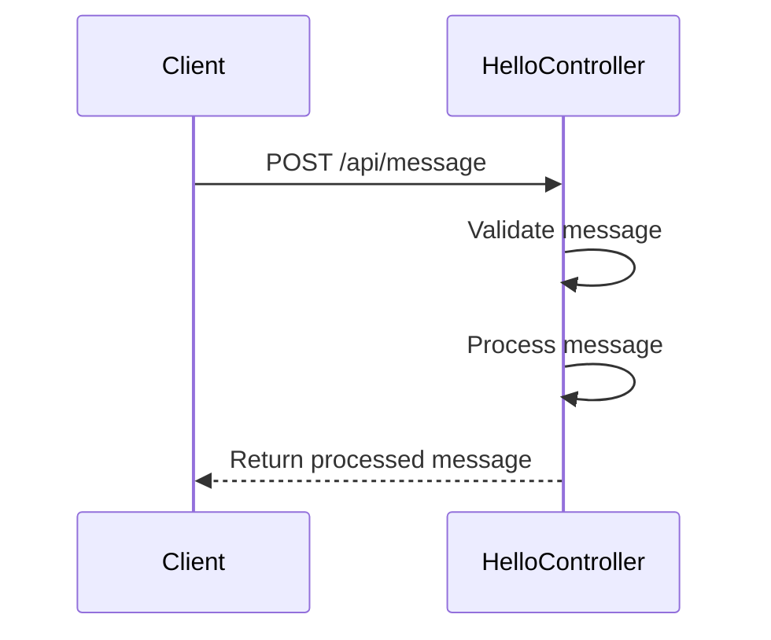
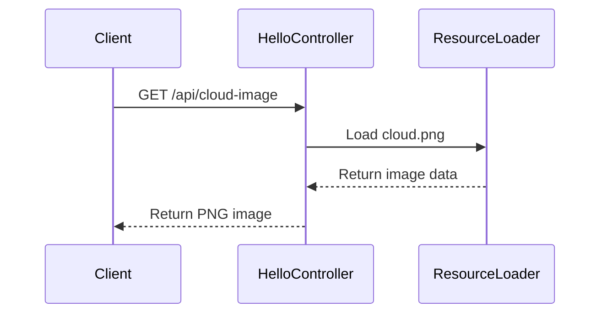

# System Design Documentation

## Architecture Overview

This Spring Boot REST API project follows a layered architecture pattern with the following components:

```
┌─────────────────┐
│    Controller   │
│     Layer      │
├─────────────────┤
│    Service     │
│     Layer      │
├─────────────────┤
│   Repository   │
│     Layer      │
└─────────────────┘
```

## Component Breakdown

### Controllers
- `HelloController`: Handles basic REST endpoints
  - GET /api/hello
  - GET /api/hello/{name}
  - POST /api/message
  - GET /api/cloud-image

## Sequence Diagrams

### GET /api/hello Endpoint



### GET /api/hello/{name} Endpoint



### POST /api/message Endpoint



### GET /api/cloud-image Endpoint



## Technical Specifications

### REST API Design

1. **URL Structure**
   - Base URL: `/api`
   - Resource-based endpoints
   - Clear naming conventions

2. **HTTP Methods**
   - GET: Retrieve resources
   - POST: Create/Process resources

3. **Response Formats**
   - JSON for API responses
   - PNG for image endpoint
   - UTF-8 encoding

### Error Handling

```
┌─────────────────────┐
│   Error Response    │
├─────────────────────┤
│ - Status Code       │
│ - Error Message    │
│ - Timestamp        │
└─────────────────────┘
```

## Testing Strategy

1. **Unit Tests**
   - Controller layer testing
   - Mocked dependencies
   - Coverage targets: 80%+

2. **Integration Tests**
   - End-to-end API testing
   - Real HTTP requests
   - Response validation

## Security Considerations

1. **Input Validation**
   - Sanitize all inputs
   - Validate request parameters
   - Check content types

2. **Resource Protection**
   - Rate limiting (future)
   - Authentication (future)
   - Authorization (future)

## Future Enhancements

1. **Short Term**
   - Add authentication
   - Implement rate limiting
   - Enhanced error handling

2. **Long Term**
   - API versioning
   - Cache implementation
   - Metrics collection